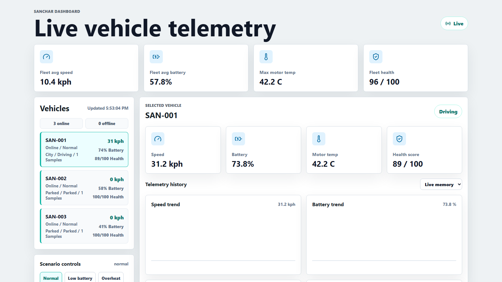

# Sanchar Dashboard

Real-time EV telemetry dashboard that streams coherent mock vehicle data over WebSockets and visualizes live fleet state, health, alerts, scenarios, and local tracking.

Sanchar Dashboard is designed as a portfolio project for vehicle software, energy software, real-time systems, and telemetry-heavy engineering roles.

## Project Status

Production-ready portfolio build. The backend is cloud-compatible with REST and WebSocket traffic served from one public port, and the frontend is ready for Vercel deployment.

## Features

- React + TypeScript dashboard with live telemetry cards and charts
- Node.js WebSocket telemetry service
- Three coherent mock EVs with related speed, battery, range, power, temperature, and location values
- Scenario controls: `normal`, `low-battery`, `overheat`, `charging`, `offline`
- Local vehicle tracking with online/offline state, last-seen age, and sample counts
- Health score and alert generation
- Vehicle comparison panel
- Mock fleet map with route trail
- Optional InfluxDB persistence and history queries
- REST API for health, metrics, fleet state, history, alerts, and scenarios
- Docker Compose, GitHub Actions CI, tests, and deployment config

## Tech Stack

React, TypeScript, Vite, Node.js, WebSockets, InfluxDB, Docker, GitHub Actions, Vercel, Render.

## Preview



More portfolio-ready 16:9 screenshots are available in [docs/SCREENSHOTS.md](docs/SCREENSHOTS.md).

## Run Locally

```bash
npm install
npm run dev
```

Open:

```text
http://localhost:5173
```

Local services:

```text
Frontend: http://localhost:5173
Backend API: http://localhost:8090
WebSocket: ws://localhost:8090
```

## Scenario Demo

1. Select a vehicle from the left sidebar.
2. Use **Scenario controls** below the vehicle list.
3. Click:
   - **Low battery**: battery/range drop, health degrades, alert appears
   - **Overheat**: temperatures rise, thermal alerts appear
   - **Charging**: speed becomes `0`, power turns negative, state becomes charging
   - **Offline**: vehicle is marked offline in local tracking
   - **Normal**: vehicle returns to a healthy baseline

## API

```text
GET /health
GET /metrics
GET /api/vehicles
GET /api/vehicles/:vehicleId/latest
GET /api/vehicles/:vehicleId/history?limit=120
GET /api/vehicles/:vehicleId/history?range=5m
GET /api/fleet/summary
GET /api/simulator
POST /api/simulator/scenario
POST /api/alerts/:alertId/acknowledge
POST /api/alerts/:alertId/resolve
```

More details: [docs/API.md](docs/API.md)

## Optional InfluxDB

Copy `.env.example` to `.env` and configure:

```text
INFLUX_URL=http://localhost:8086
INFLUX_TOKEN=...
INFLUX_ORG=sanchar
INFLUX_BUCKET=vehicle_telemetry
```

The app runs without InfluxDB. Without it, live telemetry still streams and the browser keeps local history.

## Docker

```bash
docker compose up --build
```

This starts the backend and InfluxDB. Run the React dev server separately with:

```bash
npm run client
```

## Validation

```bash
npm run typecheck
npm test
npm run build
```

The WebSocket/API integration test runs in CI and is skipped on the local Windows sandbox because process spawning is restricted there.

## Documentation

- [Documentation Index](docs/README.md)
- [Project Overview](docs/PROJECT_OVERVIEW.md)
- [Architecture](docs/ARCHITECTURE.md)
- [Telemetry Data Model](docs/DATA_MODEL.md)
- [Scenario Controls](docs/SCENARIO_CONTROLS.md)
- [Frontend Guide](docs/FRONTEND.md)
- [Backend Guide](docs/BACKEND.md)
- [API Reference](docs/API.md)
- [InfluxDB Guide](docs/INFLUXDB.md)
- [Demo Guide](docs/DEMO.md)
- [Testing Guide](docs/TESTING.md)
- [Deployment Guide](docs/DEPLOYMENT.md)
- [Deployment Status](docs/DEPLOYMENT_STATUS.md)
- [Troubleshooting](docs/TROUBLESHOOTING.md)
- [Portfolio Notes](docs/PORTFOLIO.md)
- [Resume Bullets](docs/RESUME.md)
- [Betterment Ideas](docs/BETTERMENT_IDEAS.md)
- [Screenshot Gallery](docs/SCREENSHOTS.md)

## Deployment Summary

Recommended split:

- Frontend: Vercel
- Backend: Render, Railway, Fly.io, or another WebSocket-capable Node host
- Database: InfluxDB Cloud or self-hosted InfluxDB

Frontend environment variables:

```text
VITE_WS_URL=wss://<your-backend-host>
VITE_API_URL=https://<your-backend-host>
```

Backend environment variables:

```text
PORT=<provided by host>
INFLUX_URL=<optional>
INFLUX_TOKEN=<optional>
INFLUX_ORG=<optional>
INFLUX_BUCKET=<optional>
API_TOKEN=<optional>
```

Full deployment guide: [docs/DEPLOYMENT.md](docs/DEPLOYMENT.md)
