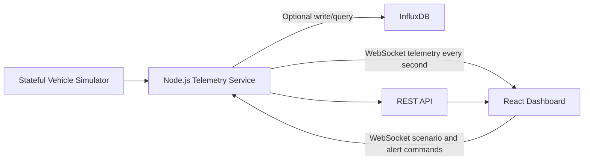

# Architecture

Sanchar Dashboard is split into a React frontend and a Node.js backend. The backend owns telemetry generation, WebSocket streaming, optional REST APIs, and optional InfluxDB persistence. The frontend owns live visualization, local tracking, scenario UI, and user interaction.

## High-Level Diagram



## Runtime Components

### Frontend

Location:

```text
src/
```

Responsibilities:

- connect to WebSocket telemetry stream
- render fleet summary
- track vehicle online/offline state locally
- show charts, alerts, map, and comparison
- apply scenario controls immediately in UI
- send scenario/alert commands to backend

### Backend

Location:

```text
server/
```

Responsibilities:

- generate coherent telemetry for three mock EVs
- stream telemetry over WebSockets
- accept WebSocket commands
- expose REST APIs
- calculate health score and alerts
- store short in-memory history
- optionally write/query InfluxDB

### Optional InfluxDB

InfluxDB is used for time-series persistence. The app runs without it, but when configured it can write telemetry samples and query history ranges.

## Data Flow

1. Backend updates each vehicle state once per second.
2. Backend derives telemetry values from the vehicle state.
3. Backend sends a WebSocket `telemetry` message to connected clients.
4. Frontend normalizes and enriches the incoming vehicles.
5. Frontend updates local tracking and chart history.
6. User clicks scenario control.
7. Frontend applies local scenario override immediately.
8. Frontend sends scenario command over WebSocket.
9. Backend applies scenario to simulator state.
10. Future telemetry ticks continue from that scenario state.

## Why This Architecture

WebSockets are used because telemetry is push-based. The backend should push new samples when they exist instead of the frontend repeatedly polling.

React local state is used for browser-side tracking because demo interaction must stay responsive even if backend acknowledgement is delayed.

InfluxDB is optional because the MVP should work without external infrastructure.

## Important Files

```text
server/index.ts          WebSocket server, REST API, metrics, command handling
server/telemetry.ts      Vehicle simulator, scenarios, health, alerts
server/influx.ts         Optional InfluxDB adapter
src/main.tsx             Frontend orchestration and WebSocket lifecycle
src/components/          Dashboard UI panels
src/lib/api.ts           REST API client
src/lib/math.ts          Small math/display helpers
tests/                   Simulator and integration tests
```

## Local Ports

```text
Frontend: 5173
WebSocket: 8080
REST API: 8090
InfluxDB: 8086
```

## Production Note

The local backend currently uses separate ports for WebSocket and REST. Many cloud hosts expose a single public port. Before production deployment, the backend should be updated to attach WebSocket and REST handling to one HTTP server.
