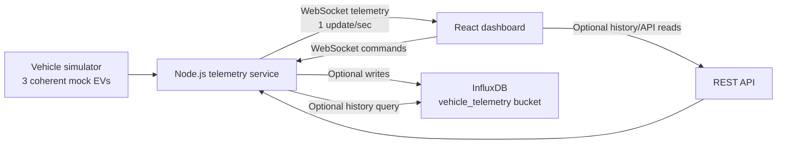

# Sanchar Dashboard Architecture

Sanchar Dashboard is a real-time EV telemetry demo with a React dashboard, Node.js telemetry service, WebSocket stream, optional REST API, and optional InfluxDB persistence.

## System Flow

## Main Parts

- `server/telemetry.ts`: stateful vehicle simulator, scenario logic, health score, alerts, and coherent metric derivation.
- `server/index.ts`: WebSocket server, REST API, command handling, heartbeat, in-memory history, metrics, and shutdown flow.
- `server/influx.ts`: optional InfluxDB writer and history query adapter.
- `src/main.tsx`: dashboard state orchestration, WebSocket lifecycle, local tracking, scenario override handling.
- `src/components/*`: focused dashboard panels for fleet summary, vehicles, scenarios, alerts, charts, comparison, and map.

## Data Model

Each vehicle telemetry sample includes:

- identity: `vehicleId`, `timestamp`
- movement: `speedKph`, `location`, `odometerKm`
- energy: `batteryPct`, `rangeKm`, `powerKw`, `efficiencyKwhPer100Km`
- thermal: `batteryTempC`, `motorTempC`, `cabinTempC`
- state: `driveMode`, `stateOfCharge`, `scenario`
- diagnostics: `healthScore`, `alerts`

## Scenario Model

Scenario controls are deterministic and locally resilient:

- `normal`: restores healthy values and clears alerts
- `low-battery`: low battery, low range, degraded health, low-battery alert
- `overheat`: high motor/battery temperatures, degraded health, thermal alerts
- `charging`: zero speed, negative power, charging state
- `offline`: removes the vehicle from live telemetry while local tracking marks it offline

The browser applies a local scenario override immediately, then sends a WebSocket command to the backend. This keeps the demo responsive even if the backend is stale or slow to acknowledge.

## Why WebSockets

Telemetry is pushed continuously from backend to frontend. A normal REST polling loop would add delay and unnecessary request overhead. WebSockets keep one persistent connection open and let the backend push each new sample as soon as it is generated.

## Why InfluxDB

InfluxDB is optimized for time-series data. Vehicle telemetry is naturally time-series data because every sample is tied to a timestamp and needs historical queries such as last 5 minutes, 30 minutes, or 1 hour.
