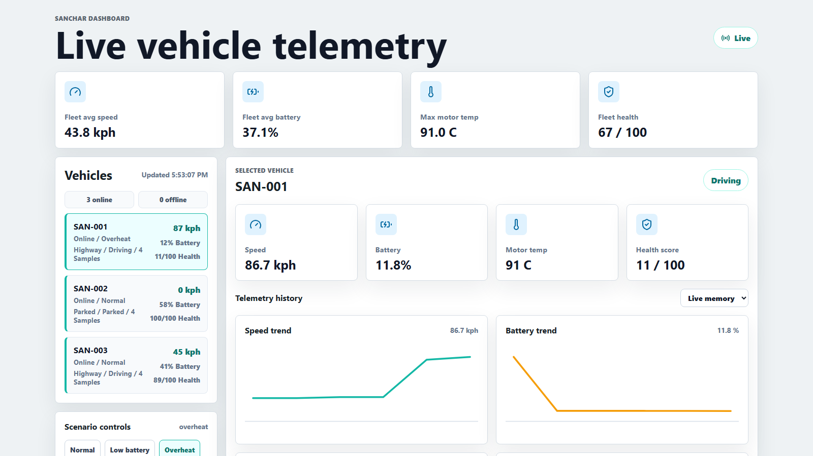
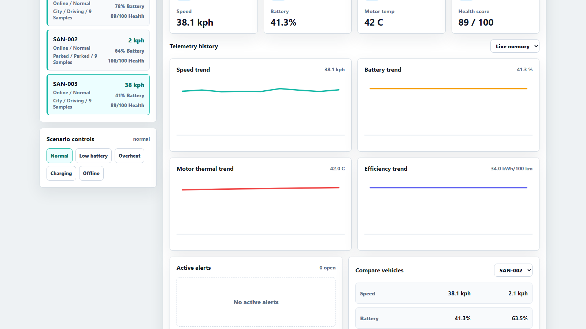
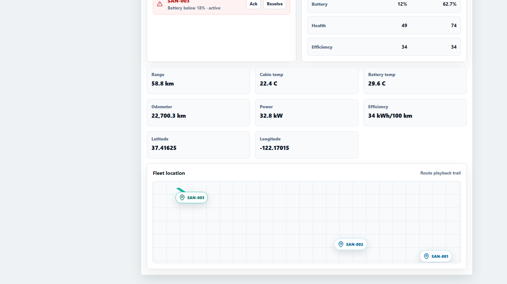

# Screenshot Gallery

All screenshots are captured as `1600x900` 16:9 PNGs for portfolio, LinkedIn, and README use.

## Recommended LinkedIn Carousel

1. `01-main-dashboard.png` - first slide, complete dashboard overview
2. `03-overheat-alerts.png` - failure scenario with thermal risk
3. `08-scenario-controls-panel.png` - interactive scenario controls
4. `10-active-alerts-panel.png` - alert monitoring workflow
5. `13-fleet-location-route.png` - fleet location and route trail

## Screenshots

| File | Focus |
| --- | --- |
| `01-main-dashboard.png` | Main live telemetry dashboard |
| `02-low-battery-scenario.png` | Low battery scenario |
| `03-overheat-alerts.png` | Overheat scenario and alert impact |
| `04-charging-state.png` | Charging state |
| `05-fleet-map-route.png` | Fleet map route playback |
| `06-selected-vehicle-san-002.png` | Selected vehicle SAN-002 |
| `07-selected-vehicle-san-003.png` | Selected vehicle SAN-003 |
| `08-scenario-controls-panel.png` | Scenario control panel |
| `09-low-battery-fleet-impact.png` | Fleet-level low battery impact |
| `10-active-alerts-panel.png` | Active alerts panel |
| `11-vehicle-comparison-panel.png` | Vehicle comparison panel |
| `12-vehicle-detail-metrics.png` | Detailed vehicle metrics |
| `13-fleet-location-route.png` | Fleet location and route trail |
| `14-charging-scenario-state.png` | Charging scenario state |
| `15-offline-local-tracking.png` | Offline local tracking |

## Preview Images

